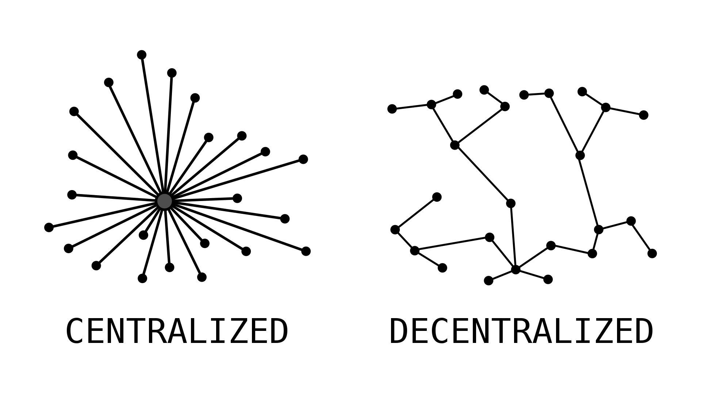

# Co je to DAO?

**Decentralizovaná autonomní organizace \(DAO\) je efektivní a bezpečný způsob spolupráce s podobně smýšlejícími lidmi po celém světě.**

Představte si je jako internetový podnik, který je společně vlastněn a řízen svými členy. Má vlastní pokladnu, ke které nemá nikdo oprávnění přistupovat bez souhlasu skupiny. Rozhodování se řídí návrhy a hlasováním, aby měl každý člen organizace možnost vyjádřit svůj názor.

Neexistuje žádný generální ředitel, který by mohl schvalovat výdaje na základě vlastních rozmarů, ani možnost, že by pochybný finanční ředitel manipuloval s účetnictvím. Všechno je otevřené a pravidla týkající se výdajů jsou prostřednictvím kódu DAO vynucena systémem.


Tuto příručku pro vás tvoří [Gwei.cz komunita](https://gwei.cz). Pokud chcete pomoci s psaním, něco doplnit či upřesnit, nebo máte jakékoliv jiné připomínky, tak se na nás obraťte na našem [Fóru](https://forum.gwei.cz/) nebo [Discordu](https://chat.gwei.cz). Uvítáme jakoukoliv pomoc!


