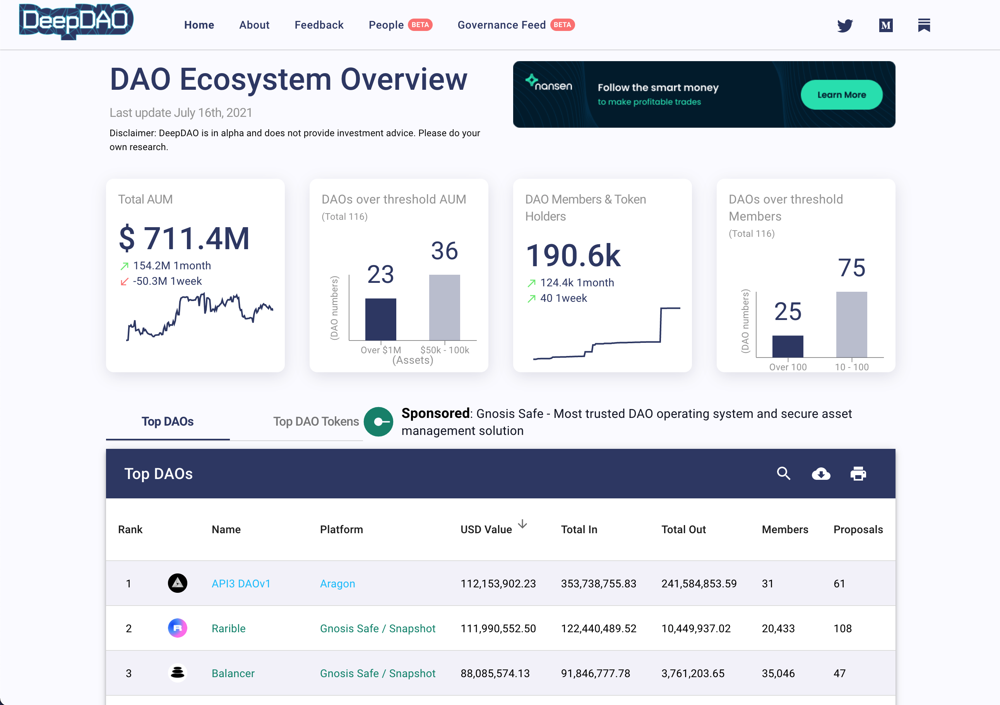
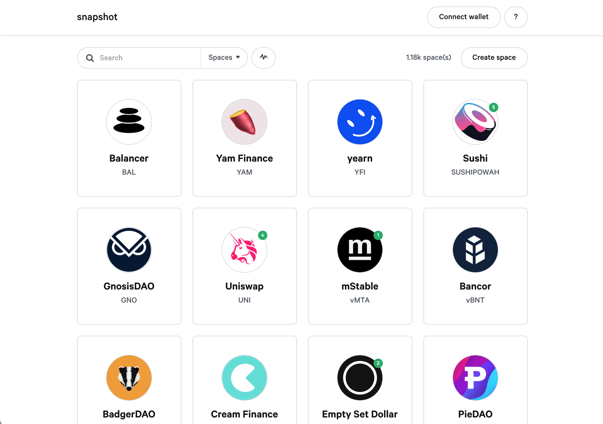

# Nástroje

## Katalogy DAO

### [Deep DAO](https://deepdao.io/)

Katalog všech významějších decentralizovaných organizací, včetně různých statistik.

## Off-chain hlasování

### [Snapshot](https://snapshot.org/#/)

Aplikace, pomocí které můžete provádět bezpečné signální hlasování mimo blockchain \(off-chain\). Hlasování je tedy úplně zdarma, bez transakčních poplatků \(gas-less\). Záznamy se ukládají na decentralizované úložiště [IPFS](https://ipfs.io/).

