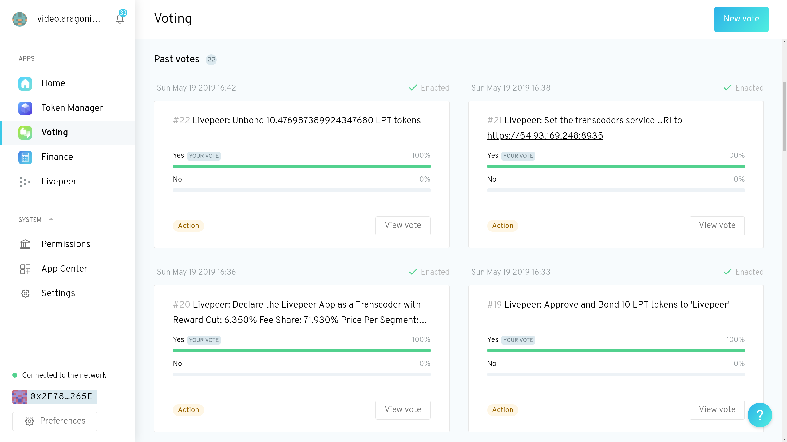
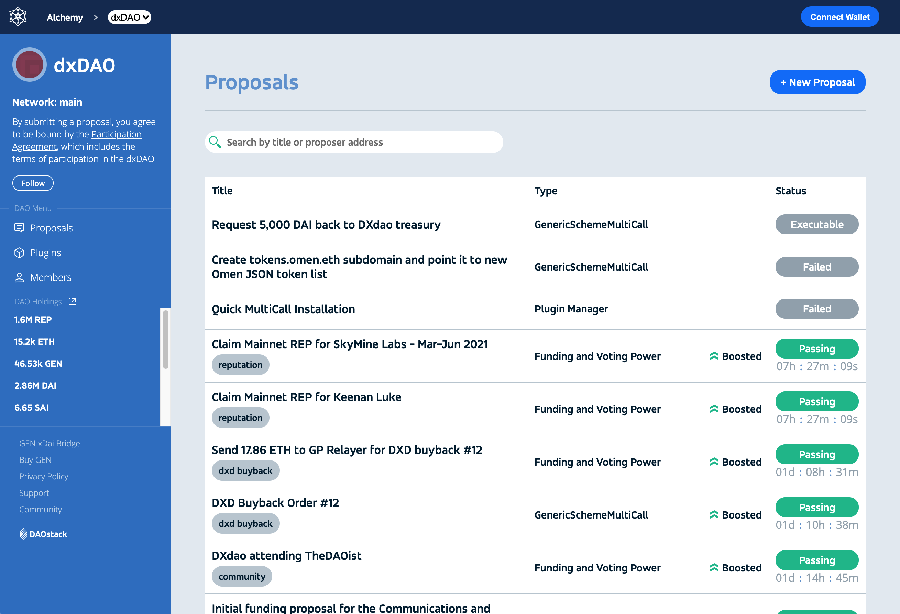

# Platformy

DAO platformy jsou bezpečné šablony smart-kontraktů a uživatelské rozhraní, pomocí kterého může [vlastní DAO vytvořit](jak-vytvorit-dao.md) a ovládat kdokoli.

## Srovnání platforem

| Platforma | Podporované sítě | Pravidla |
| :--- | :--- | :--- |
| [Aragon](dao-platformy.md#aragon) | Ethereum | Modulární |
| [DAOhaus](dao-platformy.md#daohaus) | Ethereum, xDai, Polygon | [Moloch](clenstvi-v-dao.md#clenstvi-zalozene-na-podilech-shares) |
| [DAOstack](dao-platformy.md#daostack) | Ethereum, xDai | ? |
| [Colony](dao-platformy.md#colony) | Ethereum, xDai | ? |

## Přehled platforem

### [Aragon](https://aragon.org/)

Nejstarší Ethereum DAO platforma, která nabízí univerzální použití. Systém je modulární, složen z různých komponent jako jsou Finance, Hlasování, Tokeny, atp. které si můžete sestavit jak budete chtít. Samotné webové rozhraní funguje decentralizovaně přes [IPFS](https://ipfs.io/), kvůli tomu může být pomalejší. Velkou nevýhodou je chybějící podpora sidechainů nebo druhé vrstvy, podporováno je jen Ethereum \(zatím\).

Podporované sítě: **Ethereum**  
Reálné ukázky UI: [Airalab](https://mainnet.aragon.org/#/aira), [PieDAO](https://client.aragon.org/#/piedao), [NFTX](https://client.aragon.org/#/nftx/)

### [DAOhaus](https://daohaus.club/)

DAO framework, který vznikl přímo z konceptu Moloch, je tedy vhodný zvláště pro DAO s [členstvím založeným na podílech](clenstvi-v-dao.md#clenstvi-zalozene-na-podilech-shares). V současné době se používají vylepšené smart-kontrakty [Molochv2.1](https://github.com/HausDAO/Molochv2.1). Platforma podporuje bez problému více sítí, včetně testnetů.

Podporované sítě: **Ethereum, xDai, Polygon**  
Reálné ukázky UI: [MetaCartel](https://app.daohaus.club/dao/0x1/0x4570b4faf71e23942b8b9f934b47ccedf7540162), [Raid Guild](https://app.daohaus.club/dao/0x64/0xfe1084bc16427e5eb7f13fc19bcd4e641f7d571f), [BohemianDAO](https://app.daohaus.club/dao/0x64/0xf762ace2c215fdad031b33c656982718c4084786)

### [DAOstack](https://daostack.io/)

TODO

Podporované sítě: **Ethereum, xDai**  
Reálné ukázky UI: [dxDAO](https://alchemy.daostack.io/dao/0x519b70055af55a007110b4ff99b0ea33071c720a)

### [Colony](https://colony.io/)

TODO

Podporované sítě: **Ethereum, xDai**

