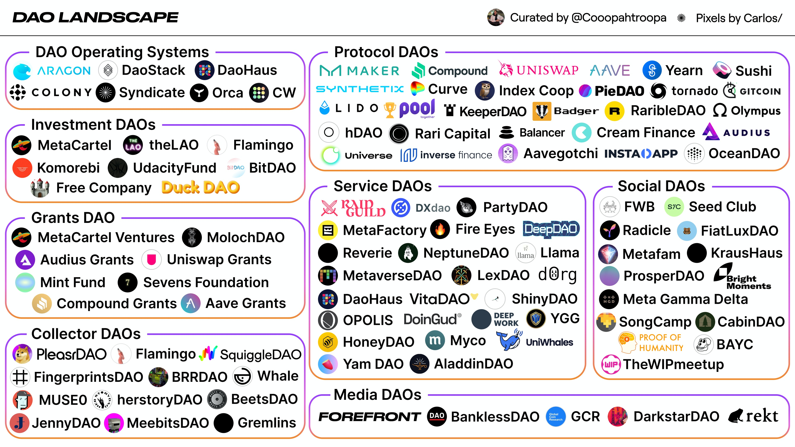

# Proč potřebujeme DAO?

Založit s někým organizaci, která zahrnuje financování a peníze, vyžaduje velkou důvěru v lidi, se kterými spolupracujete. Je však těžké důvěřovat někomu, s kým jste dosud komunikovali pouze na internetu. U DAO nemusíte věřit nikomu jinému ze skupiny, jen kódu DAO, který je 100% transparentní a ověřitelný kýmkoli.

To otevírá mnoho nových možností globální spolupráce a koordinace.


Pokud vás zajímá decentralizace organizací a evoluce lidské kooperace hlouběji, můžeme doporučit knihu [Budoucnost organizací](https://www.peoplecomm.cz/budoucnost-organizaci) od Frederica Lalouxe.


## Srovnání s tradičními organizacemi

| DAO | Tradiční organizace |
| :--- | :--- |
| Obvykle ploché a plně demokratizované. | Obvykle hierarchické. |
| Pro provedení jakýchkoli změn je nutné hlasování členů. | V závislosti na struktuře mohou být změny požadovány od jediné strany nebo může být nabídnuto hlasování. |
| Hlasy se sčítají a výsledek se provádí automaticky bez důvěryhodného prostředníka. | Pokud je povoleno hlasování, hlasy se sčítají interně a výsledek hlasování se musí realizovat ručně. |
| Nabízené služby jsou zpracovávány automaticky decentralizovaným způsobem \(například rozdělování dobročinných fondů\). | Vyžaduje lidskou obsluhu nebo centrálně řízenou automatizaci, náchylnou k manipulaci. |
| Veškerá činnost je transparentní a plně veřejná. | Činnost je obvykle neveřejná a pro veřejnost omezená. |

## Příklady DAO

Pro lepší představu uvádíme několik příkladů použití DAO:

* **Dobročinná organizace** - můžete přijímat členství a dary od kohokoli na světě a organizace může rozhodnout, jak s dary naloží.
* **Síť freelancerů** - můžete vytvořit síť kontraktorů, kteří sdružují své prostředky na kancelářské prostory a předplatné softwaru.
* **Rizikové fondy a granty** - můžete vytvořit rizikový fond, který sdružuje investiční kapitál a hlasuje o tom, které podniky podpořit. Vrácené peníze by se později mohly přerozdělit mezi členy DAO.

